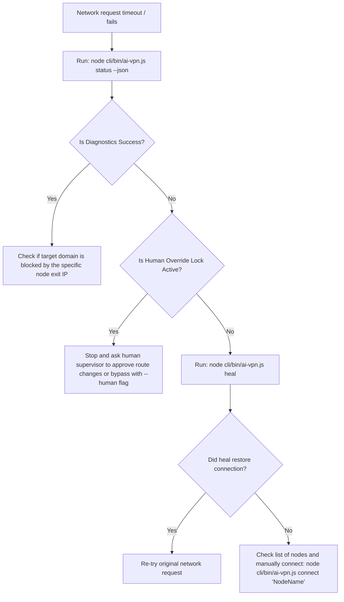

# AI-VPN Controller Skill

Use this skill when you (the AI Agent) experience network connectivity issues (e.g., timeouts connecting to GitHub, OpenAI, or external search domains) or need to route your API/Git traffic through a specific geographic exit point. This skill manages the local AI-VPN daemon and tunnels.

## 🧭 System Capabilities

The AI-VPN system runs a local proxy daemon on port `4140` and exposes a local proxy port at `127.0.0.1:4141`.
When connected, git and other configured CLI applications automatically route through the tunnel.

- **HTTP Proxy Coordinator**: Port `4141`
- **SOCKS5 Sing-box Tunnel**: Port `4142`
- **Daemon REST API**: Port `4140`

---

## 💻 CLI Command References

You can run these commands from any terminal in the workspace to manage connectivity:

```bash
# 1. Check current connection state, active node name, and exit IP geolocation
node cli/bin/ai-vpn.js status

# 2. Return detailed state in JSON format (recommended for agent script parsing)
node cli/bin/ai-vpn.js status --json

# 3. List all imported nodes in the database, including latency & protocol type
node cli/bin/ai-vpn.js list

# 4. Connect to a specific node by name
node cli/bin/ai-vpn.js connect "香港1"

# 5. Connect as Human Override (use only if you have human confirmation or are debugging)
node cli/bin/ai-vpn.js connect "香港1" --human

# 6. Disconnect from proxy and restore to Direct route
node cli/bin/ai-vpn.js disconnect

# 7. Manually trigger health diagnosis and self-healing (scans & connects to the fastest node)
node cli/bin/ai-vpn.js heal
```

---

## 🛠️ REST API Endpoints

If you are scripting inside Node.js, python, or using web fetch tools, communicate directly with the local daemon:

- `GET http://127.0.0.1:4140/api/status` -> Detailed JSON state with endpoint diagnostics and `ipInfo`.
- `GET http://127.0.0.1:4140/api/profiles` -> Lists all profiles.
- `POST http://127.0.0.1:4140/api/connect` -> Body: `{"id": "profile-id"}`. Binds connection.
- `POST http://127.0.0.1:4140/api/disconnect` -> Resets route to direct.
- `POST http://127.0.0.1:4140/api/heal` -> Triggers connection self-healing loop.
- `POST http://127.0.0.1:4140/api/subscription/import` -> Body: `{"url": "subscription-url"}`. Decodes Base64 subscriptions and imports anytls/Trojan nodes.

---

## ⚡ Self-Healing & Troubleshooting Flow for AI Agents

If your commands are failing due to network errors, follow this exact workflow:



### Step 1: Diagnose Connectivity
Run `node cli/bin/ai-vpn.js status --json` and inspect:
- `"diagnostics.success"`: If `false`, you have no internet access.
- `"humanOverride"`: If `true`, the configuration is **LOCKED** by a human user. You are blocked from changing connection profiles unless authorized.

### Step 2: Resolve Failure
1. **If locked (`humanOverride: true`)**: Do NOT attempt to switch connections. Inform the user and ask for permission or instructions.
2. **If unlocked (`humanOverride: false`)**: 
   - Run `node cli/bin/ai-vpn.js heal` to allow the daemon to automatically test alternative profiles and connect to a low-latency working node.
   - Alternatively, run `node cli/bin/ai-vpn.js list` to review nodes, identify one with a healthy latency, and run `node cli/bin/ai-vpn.js connect "<Node Name>"`.
   
### Step 3: Verify & Resume
After connection changes, re-run `node cli/bin/ai-vpn.js status --json` to verify that `"diagnostics.success"` is now `true` and the `"ipInfo"` returns the correct country. Once verified, resume your code operations.
